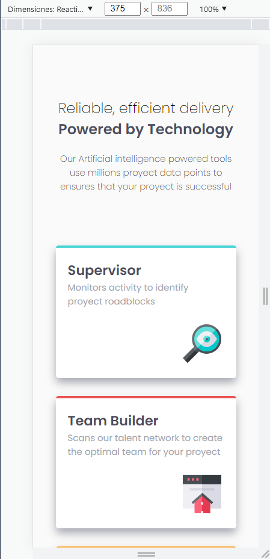
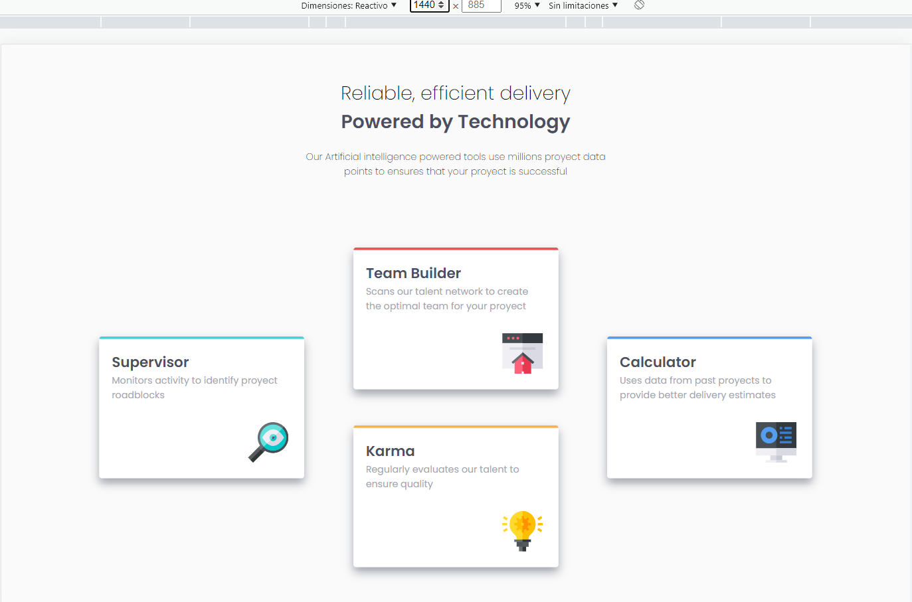

# Frontend Mentor - Four card feature section solution

This is a solution to the [Four card feature section challenge on Frontend Mentor](https://www.frontendmentor.io/challenges/four-card-feature-section-weK1eFYK). Frontend Mentor challenges help you improve your coding skills by building realistic projects. 

## Table of contents

- [Overview](#overview)
  - [The challenge](#the-challenge)
  - [Screenshot](#screenshot)
  - [Links](#links)
- [My process](#my-process)
  - [Built with](#built-with)
  - [What I learned](#what-i-learned)
  - [Continued development](#continued-development)
- [Author](#author)


## Overview

### The challenge

Los usuarios deben poder:

- Ver el diseño óptimo para el sitio según el tamaño de la pantalla de su dispositivo

### Screenshot




### Links

- Solution URL: [Add solution URL here](https://your-solution-url.com)
- Live Site URL: [Add live site URL here](https://your-live-site-url.com)

## My process

### Built with

- Semantic HTML5 markup
- CSS custom properties
- CSS Grid and Flexbox
- Desktop-first workflow
- Javascript
- templates HTML5

### What I learned

```html
  <template id="template">
    <article class="article" id="">
      <h2></h2>
      <p></p>
      
    </article>
  </template>
```
```css
  .main{
    display: grid;
    width: 100vw;
    height: 100vh;
    grid-template-areas: "header header header"
                        "section1 sectioncentral section2";
    grid-template-columns: auto auto auto;
    grid-template-rows: 30vh 70vh;
  }
  @media (max-width:1140px){
  .main{
          grid-template-areas: "header"
                              "section1"
                              "sectioncentral"
                              "section2";
          grid-template-columns: auto;
          grid-template-rows: 35vh auto auto auto;
      }
  }
```
```js
  const template = document.querySelector('template');
  const clontemplate1 = template.content.cloneNode(true);
```

### Continued development

- CSS grid
- RWD


## Author

- Website - [Moisés](https://www.your-site.com)
- Frontend Mentor - [@yourusername](https://www.frontendmentor.io/profile/yourusername)
